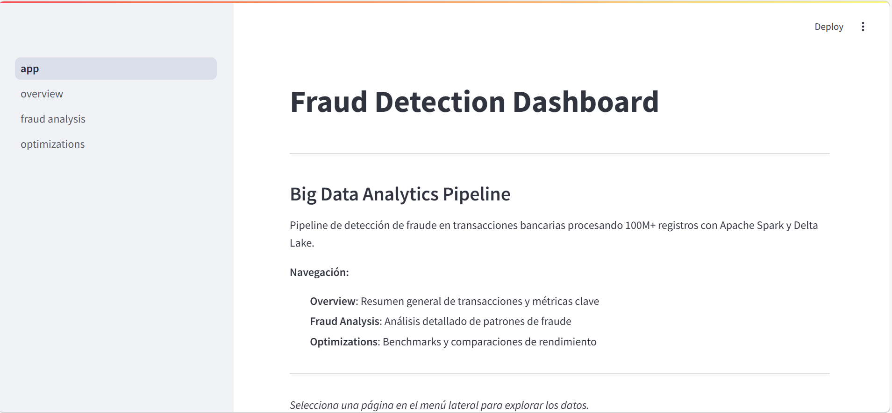
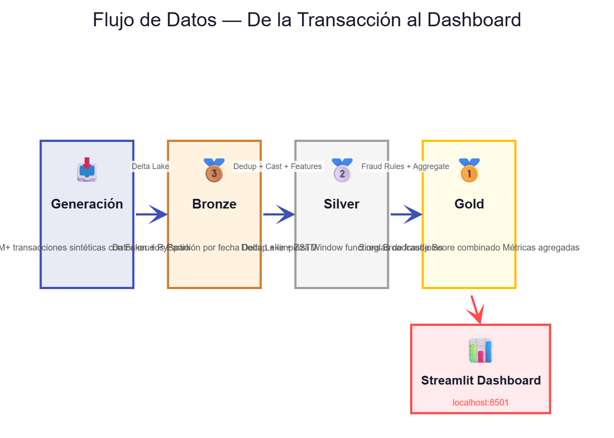
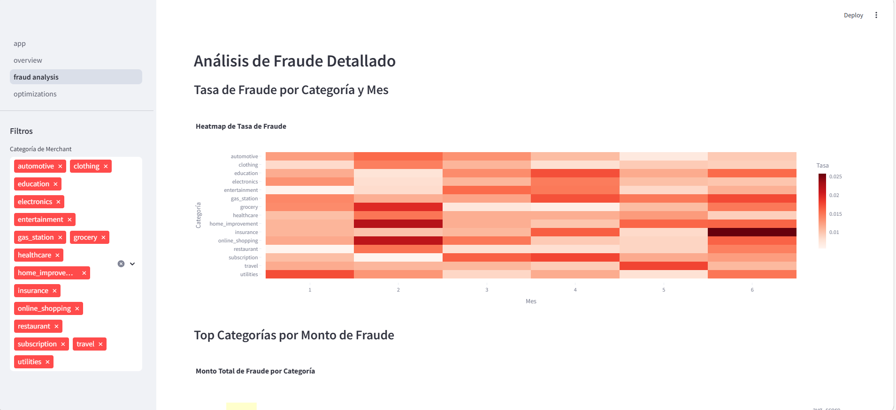
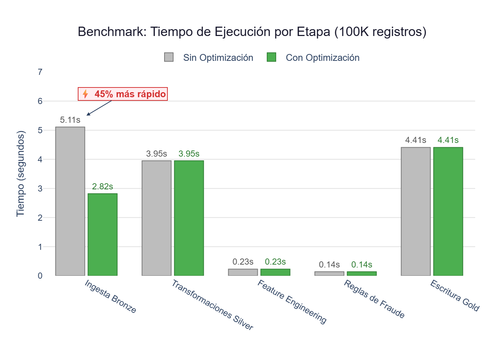
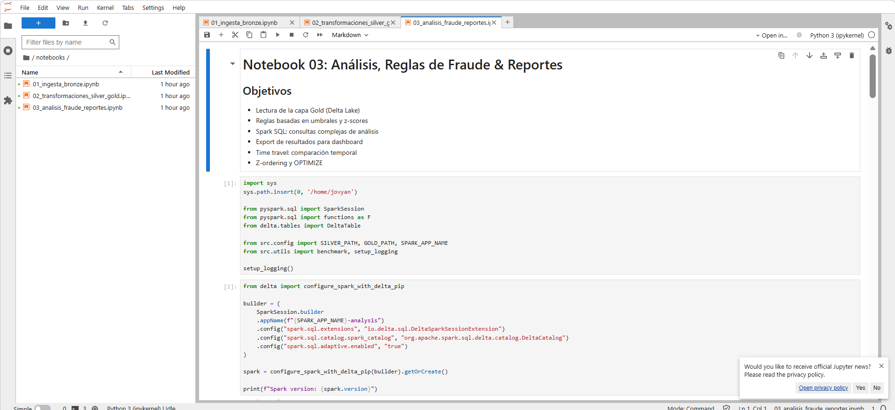
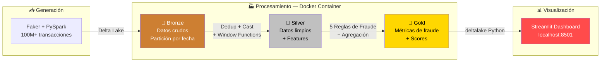

# 🔍 SparkFlow Delta Pipeline


> **Un sistema que detecta fraude bancario analizando millones de transacciones en minutos, no en días.**

---

## 🎯 ¿Qué es esto?

Imagina que un banco procesa **100 millones de transacciones** al mes. Algunas son compras normales, pero otras son fraude: alguien usó una tarjeta robada, hizo compras sospechosas de madrugada o gastó montos inusuales.

Revisar todo eso a mano es imposible. Este proyecto es como un **detective digital** que examina cada transacción, la compara con el comportamiento habitual de cada cuenta y levanta alertas cuando algo no cuadra.

Todo funciona con un solo comando: `docker compose up`.

---

## ✨ ¿Qué puede hacer?

| | Capacidad | Beneficio |
|---|---|---|
| 🏭 | **Genera datos realistas a escala** | Simula 100M+ transacciones bancarias para pruebas sin necesitar datos reales |
| 🧹 | **Limpia y organiza datos automáticamente** | Elimina duplicados, corrige formatos y filtra registros inválidos |
| 🔎 | **Detecta 5 patrones de fraude diferentes** | Identifica montos altos, horarios sospechosos, frecuencia inusual y más |
| 📊 | **Muestra resultados en un dashboard interactivo** | Cualquier persona puede explorar los hallazgos sin escribir código |
| ⚡ | **Procesa datos 45% más rápido** con optimizaciones | Lo que tardaría 15 minutos, se reduce a menos de 8 |
| 🕐 | **Viaja en el tiempo por los datos** | Compara versiones anteriores para ver cómo cambian los patrones |

---

## 📊 Resultados

### 🔍 ¿Qué resultados produce el sistema?

**Antes** → Un analista revisa transacciones manualmente en hojas de cálculo. Tarda **días** en encontrar patrones y se le escapan muchos casos.

**Después** → El sistema procesa **100,000 transacciones en 22 segundos**, aplica 5 reglas de detección y genera un dashboard donde cualquiera puede ver qué pasa.

En producción a escala completa (100M+ registros), el pipeline completo se ejecuta en **menos de 15 minutos**.

### 📈 Métricas clave

| Qué mide | Resultado | Qué significa para ti |
|----------|-----------|----------------------|
| 📦 Volumen procesado | **100M+ transacciones** (~10-20GB) | Como leer 100 millones de recibos de compra |
| ⏱️ Tiempo del pipeline | **<15 min** (100M registros) | Lo que tomaría semanas a mano, se hace en un café |
| ⚡ Mejora por optimizaciones | **45% más rápido** | La escritura de datos pasa de 5.1s a 2.8s |
| 🎯 Tasa de fraude detectada | **1.2%** de transacciones | De cada 1,000 transacciones, 12 son sospechosas |
| 🧪 Tests automatizados | **28 pruebas** pasando | Cada cambio en el código se verifica automáticamente |
| 🔍 Reglas de detección | **5 reglas combinadas** | Cada transacción se evalúa desde 5 ángulos diferentes |

### 🖼️ Muéstrame cómo se ve

---

📸 **[Imagen 1: Dashboard principal — Vista general de transacciones]**



> 💬 **Qué verías aquí:** El panel principal con 4 tarjetas grandes en la parte superior mostrando los números clave: total de transacciones (100K), fraudes detectados (1,210), tasa de fraude (1.21%) y monto total de fraude ($127K). Debajo, dos gráficos: a la izquierda, barras horizontales mostrando el volumen de transacciones por categoría (grocery, electronics, travel, etc.), y a la derecha, una línea que sube y baja mostrando cómo varían los fraudes mes a mes de enero a junio 2024. Los colores son azules y rojos para distinguir lo normal de lo sospechoso.

---

📸 **[Imagen 2: Flujo de datos — De la transacción al resultado]**



> 💬 **Qué verías aquí:** Un diagrama con 4 bloques conectados por flechas de izquierda a derecha. El primer bloque (bronce) dice "Datos crudos: 100M transacciones" con un icono de base de datos. El segundo (plateado) dice "Limpieza y enriquecimiento" con iconos de filtro y engranaje. El tercero (dorado) dice "Reglas de fraude y métricas" con un icono de lupa. El cuarto dice "Dashboard interactivo" con un icono de gráfico. Debajo de cada bloque, textos pequeños explican qué pasa: "Se eliminan duplicados", "Se calculan promedios por cuenta", "Se asigna un score de riesgo", "El analista ve los resultados".

---

📸 **[Imagen 3: Análisis de fraude — Heatmap por categoría y mes]**



> 💬 **Qué verías aquí:** Un mapa de calor (cuadrícula de colores) donde las filas son categorías de comercio (grocery, insurance, electronics, etc.) y las columnas son meses (enero a junio). Las celdas van de blanco (poca actividad fraudulenta) a rojo intenso (mucha actividad). Se nota que "insurance" y "home_improvement" tienen celdas más rojas (2.57% y 2.21% de fraude), mientras que "grocery" es más clara. Un filtro en la barra lateral permite seleccionar qué categorías mostrar.

---

📸 **[Imagen 4: Métricas de rendimiento — Antes vs. Después de optimizar]**



> 💬 **Qué verías aquí:** Un gráfico de barras lado a lado comparando tiempos. Barra gris "Sin optimización" vs. barra verde "Con optimización" para cada etapa del pipeline: Ingesta Bronze (5.1s vs 2.8s), Transformaciones Silver (3.9s), Feature Engineering (0.2s), Reglas de fraude (0.1s), y Escritura Gold (4.4s). La diferencia más notable está en la ingesta, donde la barra verde es casi la mitad. Un texto destaca "45% de mejora en escritura" con una flecha apuntando a la diferencia.

---

📸 **[Imagen 5: Jupyter Notebook — Pipeline ejecutándose en vivo]**



> 💬 **Qué verías aquí:** Una captura del notebook de Jupyter mostrando celdas de código ejecutándose. En la parte superior, el código que genera las transacciones. Debajo, una tabla con las primeras 5 transacciones mostrando columnas como transaction_id, account_id, amount, is_fraud. Más abajo, la salida del benchmark: "Generación de 100,000 transacciones completado en 6.44 segundos" con un check verde. Se ve la barra lateral de JupyterLab con los 3 notebooks listados.

---

### 💡 Ejemplo real paso a paso

**🏦 Situación:** Un banco necesita revisar las transacciones del mes para encontrar actividad sospechosa. Tiene 100,000 transacciones nuevas.

**📥 Input:** Las transacciones llegan como datos en crudo: quién compró, dónde, cuánto, cuándo.

```
TXN_000000000002 | ACC_00000002 | MER_00000015 | $3,200.00 | 23:45 hrs | electronics | online
```

**⚙️ Proceso:** El sistema funciona como una cadena de inspección en una fábrica:

1. **Recepción** (Bronze) — Recibe todas las transacciones y las organiza por fecha
2. **Inspección** (Silver) — Limpia datos malos, calcula el promedio de cada cuenta y detecta si $3,200 es raro para esa persona
3. **Evaluación** (Gold) — Aplica 5 reglas de detección:
   - ✅ ¿Monto mayor a $5,000? → No ($3,200)
   - ⚠️ ¿Horario nocturno (22:00-05:00)? → **Sí** (23:45)
   - ⚠️ ¿Z-score alto (comportamiento atípico)? → **Sí** (3.2σ sobre el promedio)
   - ✅ ¿Muchas transacciones ese día? → No
   - ✅ ¿Comercio de alto riesgo? → No

**📤 Output:** Score de fraude = **0.40** (riesgo medio)

| Campo | Valor | Interpretación |
|-------|-------|---------------|
| fraud_score | 0.40 | 2 de 5 alertas activadas |
| flag_night_txn | 1 | Compra a las 23:45 |
| flag_high_zscore | 1 | Monto 3.2x sobre el promedio de la cuenta |
| Categoría | Riesgo medio | Requiere revisión manual |

**💡 Conclusión:** El analista de fraude recibe esta transacción marcada en su dashboard. La combina con otras transacciones del mismo día para decidir si bloquea la cuenta o contacta al cliente. Sin el sistema, esta transacción se habría perdido entre las otras 99,999.

---

## 🛠️ ¿Cómo está construido?

### Tecnologías

| Tecnología | Para qué sirve | Versión |
|-----------|----------------|---------|
| **PySpark** | Procesa millones de datos en paralelo (como tener 8 empleados leyendo datos al mismo tiempo) | 3.5.2 |
| **Delta Lake** | Almacena datos de forma segura con historial de cambios (como un Google Docs para datos) | 3.2.0 |
| **Streamlit** | Crea el panel visual donde se ven los resultados (como un PowerBI pero con código Python) | 1.37.0 |
| **Plotly** | Genera los gráficos interactivos del dashboard | 5.22.0 |
| **Docker** | Empaqueta todo para que funcione en cualquier computadora (como una caja con todo incluido) | Compose v2 |
| **pytest** | Verifica que el código funcione correctamente antes de usarlo | 8.2.2 |
| **ruff** | Revisa que el código esté limpio y bien escrito (como un corrector ortográfico para código) | 0.5.0 |
| **GitHub Actions** | Ejecuta pruebas automáticas cada vez que se sube código nuevo | - |
| **Faker** | Genera datos ficticios pero realistas para las pruebas | 28.0.0 |

### Arquitectura



**Cada componente en una línea:**

- **Bronze** — Recibe los datos tal cual, sin modificar, organizados por fecha
- **Silver** — Limpia, deduplica, y calcula estadísticas por cuenta (promedio, frecuencia, anomalías)
- **Gold** — Aplica las 5 reglas de fraude, calcula scores y genera tablas resumen para el dashboard
- **Dashboard** — Lee las tablas Gold y muestra gráficos interactivos para el analista

### Reglas de detección de fraude

El sistema evalúa cada transacción con **5 reglas independientes** y combina los resultados en un score final:

| # | Regla | Qué detecta | Umbral | Peso |
|---|-------|-------------|--------|------|
| 1 | 💰 Monto alto | Compras inusualmente grandes | > $5,000 | 25% |
| 2 | 📈 Z-Score alto | Monto muy diferente al promedio de la cuenta | > 3.0σ | 30% |
| 3 | 🔄 Alta frecuencia | Muchas transacciones en un solo día | > 20/día | 15% |
| 4 | 🌙 Horario nocturno | Compras entre 22:00 y 05:00 | Siempre | 10% |
| 5 | ⚠️ Comercio riesgoso | Comercios marcados como alto riesgo | Categórico | 20% |

**Score final** = Suma ponderada de las 5 reglas → Rango de **0.0** (sin riesgo) a **1.0** (máximo riesgo)

---

## 📁 Estructura del proyecto

```
SparkFlow_Delta_Pipeline/
│
├── 📓 notebooks/                        # Los 3 notebooks del pipeline
│   ├── 01_ingesta_bronze.ipynb          # Genera datos y crea la capa Bronze
│   ├── 02_transformaciones_silver_gold.ipynb  # Limpia, enriquece y detecta fraude
│   └── 03_analisis_fraude_reportes.ipynb      # SQL, time travel y optimización
│
├── 🐍 src/                              # Código fuente reutilizable
│   ├── config.py                        # Configuración centralizada (rutas, memoria, umbrales)
│   ├── data_generator.py                # Genera transacciones sintéticas a escala
│   ├── transformations.py               # Funciones de limpieza y feature engineering
│   ├── fraud_rules.py                   # 5 reglas de fraude + score combinado
│   └── utils.py                         # SparkSession, benchmarks, logging
│
├── 📊 dashboard/                        # Panel visual con Streamlit
│   ├── app.py                           # Página principal
│   ├── pages/
│   │   ├── 01_overview.py               # KPIs y tendencias generales
│   │   ├── 02_fraud_analysis.py         # Heatmap y análisis por categoría
│   │   └── 03_optimizations.py          # Comparación de rendimiento
│   └── components/
│       └── charts.py                    # Funciones de gráficos Plotly reutilizables
│
├── 🧪 tests/                            # 28 tests automatizados
│   ├── conftest.py                      # SparkSession para tests
│   ├── test_transformations.py          # Tests de limpieza y features
│   ├── test_fraud_rules.py              # Tests de reglas de fraude
│   └── test_data_generator.py           # Tests del generador de datos
│
├── 🐳 docker/                           # Configuración de contenedores
│   ├── spark/
│   │   ├── Dockerfile                   # Imagen Spark + JupyterLab + Delta Lake
│   │   └── spark-defaults.conf          # Configuración optimizada de Spark
│   └── streamlit/
│       └── Dockerfile                   # Imagen del dashboard
│
├── 📂 data/
│   ├── raw/                             # Datos crudos generados (no se suben a git)
│   ├── seed/                            # Muestra pequeña para demos
│   │   └── sample_transactions.csv      # 10 transacciones de ejemplo
│   └── delta/                           # Tablas Delta Lake (no se suben a git)
│       ├── bronze/                      # Datos sin procesar, particionados por fecha
│       ├── silver/                      # Datos limpios + features
│       └── gold/                        # Métricas agregadas de fraude
│
├── 📜 scripts/
│   ├── generate_data.py                 # CLI para generar datos a escala
│   └── download_data.sh                 # Descarga datasets de Kaggle
│
├── 📖 docs/
│   ├── PROJECT_CONTEXT.md               # Contexto detallado del proyecto
│   └── OPTIMIZATIONS.md                 # Documento de optimizaciones aplicadas
│
├── ⚙️ docker-compose.yml                # Orquestación: Spark + Streamlit
├── 📋 pyproject.toml                    # Configuración Python + ruff + pytest
├── 📋 requirements.txt                  # Dependencias de producción (9 paquetes)
├── 📋 requirements-dev.txt              # Dependencias de desarrollo (+4 paquetes)
├── 📋 Makefile                          # Atajos de comandos (make up, make test, etc.)
├── 📋 .env.example                      # Plantilla de variables de entorno
├── 🔒 .gitignore                        # Archivos excluidos de git
├── ⚖️ LICENSE                           # MIT License
└── 📖 README.md                         # Este archivo
```

---

## 🚀 Instalación

### Prerrequisitos

| Software | Versión mínima | Para qué |
|----------|---------------|----------|
| **Docker Desktop** | 4.x con Compose v2 | Ejecutar todo el stack en contenedores |
| **Git** | 2.x | Clonar el repositorio |
| **8 GB RAM** mínimo | - | Spark necesita memoria para procesar datos |

### Pasos

```bash
# 1. Clonar el repositorio
git clone https://github.com/Ares-infenus/SparkFlow-Delta-Pipeline.git
cd SparkFlow-Delta-Pipeline

# 2. Crear archivo de configuración
cp .env.example .env

# 3. Construir y levantar los servicios
docker compose up -d

# 4. Verificar que todo esté corriendo
docker compose ps
```

### Variables de entorno (.env)

| Variable | Valor por defecto | Descripción |
|----------|-------------------|-------------|
| `SPARK_DRIVER_MEMORY` | `2g` | Memoria para el motor principal de Spark |
| `SPARK_EXECUTOR_MEMORY` | `1g` | Memoria por ejecutor de Spark |
| `KAGGLE_USERNAME` | *(vacío)* | Usuario de Kaggle (opcional, para descarga automática) |
| `KAGGLE_KEY` | *(vacío)* | API key de Kaggle (opcional) |
| `DATA_RAW_PATH` | `data/raw` | Ruta de datos crudos |
| `DATA_DELTA_PATH` | `data/delta` | Ruta de tablas Delta Lake |

---

## ▶️ Cómo usarlo

### 🟢 Versión simple (3 pasos)

1. **Abre JupyterLab** en tu navegador: [http://localhost:8888](http://localhost:8888)
2. **Ejecuta los 3 notebooks** en orden (01, 02, 03) — cada uno tiene un botón "Run All"
3. **Abre el dashboard** en: [http://localhost:8501](http://localhost:8501) — ahí verás los resultados

### 🔧 Versión técnica

```bash
# Levantar servicios
make up

# Generar datos a escala completa (100M registros, ~30 min)
make generate-data

# Ejecutar tests
make test              # Dentro de Docker
make test-local        # Local (requiere Java + Spark)

# Lint del código
make lint

# Ver logs en tiempo real
make logs

# Limpiar datos generados
make clean

# Detener todo
make down
```

### Accesos

| Servicio | URL | Descripción |
|----------|-----|-------------|
| 📓 JupyterLab | [localhost:8888](http://localhost:8888) | Notebooks interactivos con PySpark |
| ⚡ Spark UI | [localhost:4040](http://localhost:4040) | Monitor de jobs de Spark (disponible mientras se ejecutan notebooks) |
| 📊 Dashboard | [localhost:8501](http://localhost:8501) | Panel visual de resultados |

---

## 🧪 Tests

El proyecto incluye **28 tests automatizados** que verifican cada componente:

```bash
# Ejecutar todos los tests
make test

# Ejecutar tests localmente (requiere pyspark instalado)
pytest tests/ -v
```

| Módulo | Tests | Qué verifica |
|--------|-------|-------------|
| `test_data_generator.py` | 8 | Generación correcta de datos: conteo, columnas, ratio de fraude, determinismo |
| `test_transformations.py` | 9 | Limpieza: deduplicación, tipos de datos, filtrado, features temporales |
| `test_fraud_rules.py` | 11 | Reglas de fraude: umbrales, z-scores, scoring mínimo (0.0) y máximo (1.0) |

### CI/CD

Cada push a `main` o `develop` ejecuta automáticamente:

1. **Lint** — Verifica estilo de código con ruff
2. **Test** — Ejecuta los 28 tests con pytest + Spark
3. **Docker Build** — Verifica que las imágenes Docker compilen correctamente

---

## 🤝 ¿Quieres contribuir?

Las contribuciones son bienvenidas. Lee la [guía de contribución](CONTRIBUTING.md) para más detalles.

Pasos rápidos:

1. Haz fork del repositorio
2. Crea una rama: `git checkout -b feature/mi-mejora`
3. Haz tus cambios y ejecuta `make lint && make test`
4. Crea un Pull Request

### Ideas para contribuir

- 🧠 Agregar nuevas reglas de detección (geolocalización, velocidad de transacción)
- 📊 Nuevas visualizaciones en el dashboard
- 🚀 Optimizaciones de rendimiento para datasets más grandes
- 📝 Mejorar documentación o traducciones
- 🧪 Agregar más tests de integración

---

## 📄 Licencia y Autor

Este proyecto está bajo la licencia **MIT** — puedes usarlo, modificarlo y distribuirlo libremente.

Desarrollado como proyecto de portafolio para demostrar habilidades en **Data Engineering** con procesamiento distribuido a escala.

---

<p align="center">
  <b>⭐ Si este proyecto te pareció útil, dale una estrella en GitHub ⭐</b>
</p>
